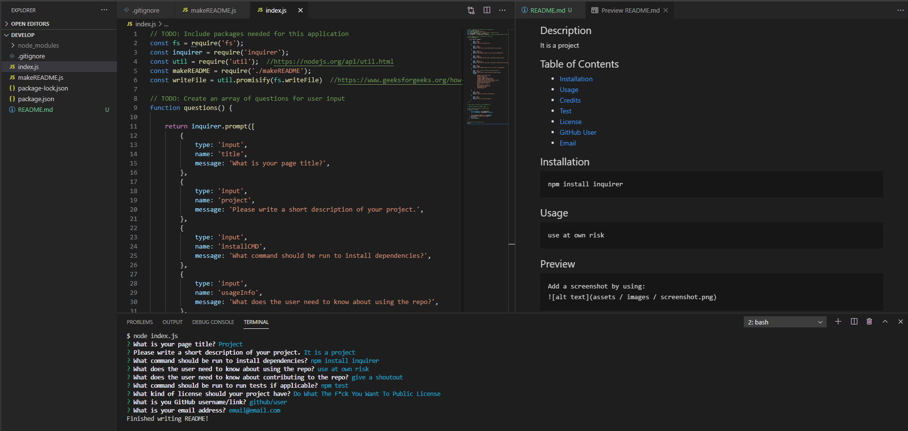

# Command-Line-Readme

## About the Readme Gen:

The purpose of this was to create a README generator using the command line and node.js to auto compile a file. 

1. When running the file with 'node index.js', present user with directions for input.
2. Present user with questions to fill out README file.
3. After each question and input, the user will press enter to continue.
4. When the user is done answering the question with inputs, prompt 'finished'.
5. The selections they chose will be generated in a README file.

## Built With:

* Javascript
* Node.js

## Use:

User can create a quick README file with the command line generator. 

*Also used to learn, practice, test, and implement: 
* npm
* cli select options
* additonal markdown syntax
* .promisify
* inquirer.promt
* await
* try/catch 

## Contact:

* https://github.com/kitclong/Command-Line-Readme

## Acknowledgments:

* MDN Web Docs
* npmjs.com
* nodejs.org 
* w3schools
* Stackoverflow
* Trilogy Education services
* Local tutoring services
